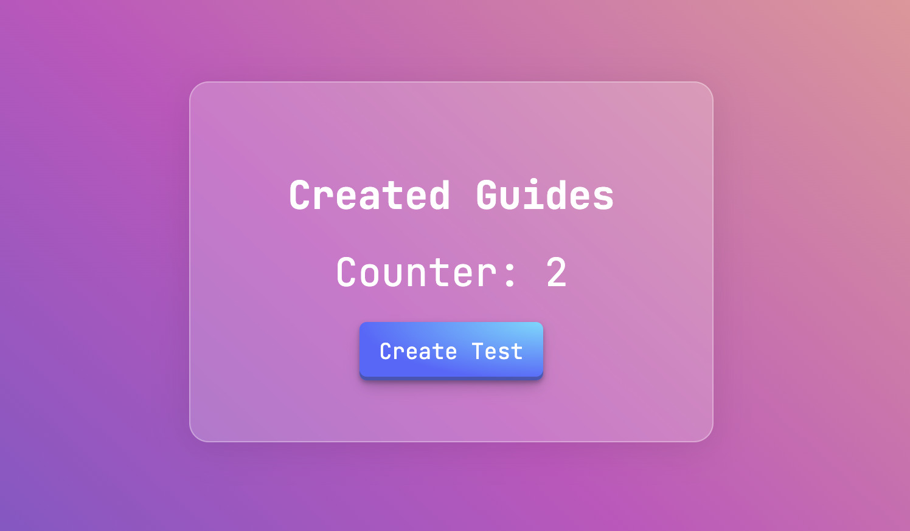

# Prueba Backend Envia.com



Esta es una aplicación en nodejs que actualiza un contador basándose en el número de guías con el estatus "Creada" usando websockets.

- Primero configuré un servidor web usando express
- Luego creé una conexión de websockets que actualiza un contador en el frontend.
- Al inicializarse la conexión se realiza una consulta a la API de envia-test para obtener el último número de guías con el estatus "Creado" (status_id = 1).
- Añadí un botón para crear una guía nueva. Al hacer click en el botón "Create Test" se envía un evento vía websocket al backend que realiza una llamada a la API para crear una guía nueva usando los datos de prueba del archivo `guide_data.json`.
- Una vez que se crea la guía nueva se realiza otra llamada a la API para obtener el valor actualizado del número de guías con el estatus "Creado" y se actualiza el contador con un websocket.
- Agregué una ruta GET que recibe un webhook de Envia cuando actualiza el estatus de una guía.

## Consideraciones

- Agregué un nuevo hook en mi panel de pruebas, al darle click en probar conexión recibía correctamente la petición GET en mi aplicación, sin embargo al crear una guía nunca pude recibir una petición del webhook para poder obtener la nueva guía creada.
- Quise utilizar los datos de prueba de la documentación pero me daba un error en el servicio del carrier usando fedex. Probé varios y me funcionó cambiarlo a DHL Express.
- En el panel de pruebas de envia al tratar de editar, eliminar o probar los webhooks me salían errores y no me permitía realizar operaciones como eliminar viejos webhooks.
- Agregué un archivo .env en donde guardé los datos sensibles como el ACCESS TOKEN y las urls de la api, etc.
- Agregué comentarios simples en partes del código y `console.log()` para ser explícito mientras desarrollo. Para una aplicación en producción removería muchos comentarios redudantes y todos los `console.log()`.

## Tecnologías usadas

- Express para el servidor web.
- Axios para las llamadas a la API.
- Socket.io para la conexión de websockets.
- Dotenv para aislar los datos sensibles
- Nodemon para no tener que reinicializar el servidor al realizar cambios durante el desarrollo.

## Instrucciones para instalar y usar la aplicación

Subí un demo de la aplicación en la siguiente URL: [https://envia-test.onrender.com/](https://envia-test.onrender.com/)

1. Clonar el repositorio.
2. Crear un archivo .env con las siguientes variables que pongo aquí por fines demostrativos:
Reemplazar `<token>` por un access token.
```
API_URI=https://api-test.envia.com/
QUERIES_URI=https://queries-test.envia.com/
ACCESS_TOKEN=<token>
```
3. Ejecutar en una terminal el comando `npm run start` o `npm run dev` para que el servidor se actualice al realizar cambios.
4. Entrar en un navegador a `http://localhost:3000/`

- Asael Chavez Jaimes
